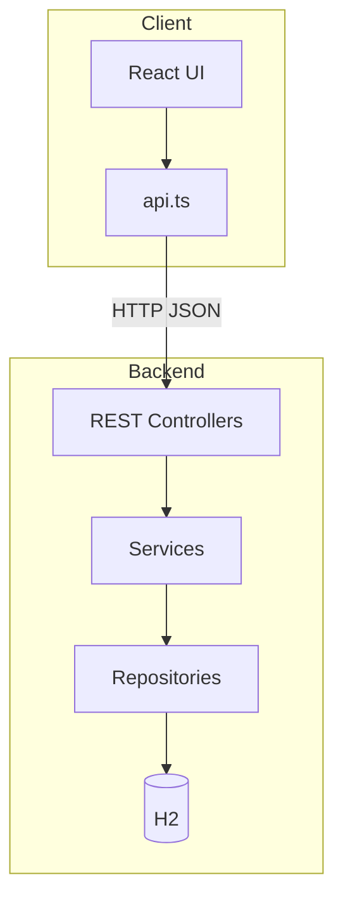

# BusApp

バス時刻表に基づき **次の発車** と **その次の発車** を表示し、**混雑の記録と（登録があるときのみ）最新混雑の表示** を行う Web / ネイティブ向けアプリです。

## システム概要（設計）

### 目的とスコープ

| 領域 | 内容 |
|------|------|
| 主機能 | 指定した路線・停車地について、**現在時刻より後で最も近い発車時刻**と、**その次に来る便の発車時刻**（存在する場合）を返し、画面に表示する |
| 付加機能 | 利用者が **混雑度（空き / 普通 / 混雑）** を投稿しサーバに蓄積する。**当該停車地に登録があれば**最新の混雑を画面に表示し、なければ混雑表示エリアは出さない |
| 想定利用形態 | ブラウザ（開発時）、Capacitor 経由のスマホアプリ（実機では API の到達先設定が必要） |

### 論理アーキテクチャ

クライアント（React SPA）は **HTTP/JSON** でバックエンド（Spring Boot）にアクセスする。永続層は **H2（インメモリ）** を使用し、アプリ起動時にスキーマ生成と初期データ投入を行う。



### データの流れ（次のバス）

1. クライアントが `routeId` / `stopId` を付与して `GET /api/bus/next` を要求する。
2. サーバは **Clock** から現在の日付・時刻を取得し、カレンダー日に応じた **曜日区分（DayType）** を解決する。
3. **時刻表（BusSchedule）** から「当該路線・停車地」「当日有効な区分」「発車時刻が現在より後」の行を **発車時刻昇順**で取得する。
4. **先頭1件**を「次の便」、**2件目があれば**「その次の便」として JSON に含める（`followingDepartureTime`、1本しか無い場合は `null`）。
5. 該当が1件もなければ **404**。フロントは「次の便」の時刻と端末の現在時刻から **あと○分** を表示する（カウントダウンは次の便のみ）。

### データの流れ（混雑）

1. 画面表示時、クライアントは `GET /api/bus/next` と **`GET /api/congestion/latest`**（同一 `routeId` / `stopId`）を **並列**で取得する。
2. **latest** が **404** のときは混雑状況を表示しない。**200** のときのみ「登録されている混雑」として最新のレベルを表示する。
3. ユーザーが混雑ボタンを押すと `POST /api/congestion` に送り、成功後に再度 **latest** を取得して表示を更新する。
4. 一覧参照は `GET /api/congestion/recent`（直近のみ、件数上限あり）。

### フロントの画面挙動（現状）

| 項目 | 内容 |
|------|------|
| 次の便 | 大きく発車時刻と「あと○分」 |
| その次の便 | `followingDepartureTime` があるときのみ、小さめの文字で「その次」として表示 |
| 混雑の表示 | 当該停車地に **混雑ログが1件でもあれば**「登録されている混雑」を表示。**一度も無ければ**当該ブロックは非表示 |
| 混雑の記録 | 「空き」「普通」「混雑」ボタンは常時表示。送信中は無効化 |
| 路線・停車地 | コード上の定数（`R1` / `STOP_MAIN`）。更新は `frontend/src/App.tsx` |

### 技術スタック（全体）

| 層 | 技術 |
|----|------|
| フロント | Vite, React 18, TypeScript |
| バックエンド | Java 17 想定, Spring Boot 3.x, Spring Web, Spring Data JPA, Bean Validation |
| DB | H2（開発・デモ用インメモリ） |
| ネイティブ枠 | Capacitor（Android 向け設定を同梱） |

### 非機能・運用上の前提

- **CORS**: `/api/**` に対し `allowedOriginPatterns("*")` を設定（開発・実機検証のしやすさ優先。本番では適切に絞ることを推奨）。
- **バインド**: サーバは `0.0.0.0:8080` で待受け、同一 LAN の実機から PC の IP で API に届けられる。
- **フロントの API 基底 URL**: 開発時は Vite の **プロキシ** で `/api` → バックエンド。実機ビルド時は `VITE_API_BASE_URL` で **PC の IP:8080** 等を指定する。

### リポジトリ構成

- [`backend/`](backend/) … REST API・ドメイン・永続化（詳細は [backend/README.md](backend/README.md)）
- [`frontend/`](frontend/) … UI・API クライアント・Capacitor（詳細は [frontend/README.md](frontend/README.md)）

---

## 実際の使い方の想定

### 誰が・いつ使うか

- **一般利用者（バス利用者）**が、**出発前やバス停で**「次の便・その次の便の時刻」と「次の便まであと何分か」を把握する想定です。
- **混雑**は、誰かが記録していれば **最新の混雑が画面に表示**され、まだ誰も記録していなければ混雑表示は出ません。自分から記録する場合は「混雑を記録」のボタンを使います。

### 端末ごとの使い方

| 形態 | 想定する操作 |
|------|----------------|
| **スマホアプリ（Capacitor）** | 次の発車と「あと○分」、必要ならその次の便。混雑登録があればその内容が表示される。混雑を伝えたいときは「空き」「普通」「混雑」をタップ。 |
| **ブラウザ（PC・スマホ）** | 開発時は同一 PC 上の URL を開く。社内・自宅 LAN 内であれば、フロントをホストするマシンの URL を開き、バックエンド API に届くようにして使う。 |

実機のスマホから PC 上の API を呼ぶ場合は、**同一 Wi-Fi** に接続し、ビルド時に **PC の LAN IP を API の向き先**（`VITE_API_BASE_URL`）として埋め込む想定です（下記「実機・Capacitor」を参照）。

### 利用者が画面で行うこと（操作の流れ）

1. アプリまたはページを開く（ネットワーク経路がバックエンドに届いていることが前提）。
2. **次の発車時刻**・**あと○分**を読む。**その次の便**がある場合は、やや小さな文字で続けて表示される。
3. 他者または自分の過去の登録により **混雑情報がある場合のみ**、「登録されている混雑」が表示される。
4. 必要なら、**混雑を記録**のいずれかをタップ。送信中はボタンが無効になり、二重送信を避ける。

### 路線・停車地について（現状の製品イメージ）

- 画面では **あらかじめ決めた路線 ID・停車地 ID**（サンプルでは `R1` と `STOP_MAIN`）を対象にしています。利用する路線が決まっている「特定路線の利用者向けミニアプリ」という想定に近いです。
- 本番で複数路線・乗り場を選べるようにする場合は、設定画面や地図連携などの UI を追加する前提です。

### データ・サーバについて利用者が意識すること

- **時刻の基準**はサーバ（または検索ロジック）の「現在時刻」に依存します。端末の時刻が大きくずれていると、表示と実際の発車が一致しないことがあります。
- 現在のデモ構成では DB が **H2 インメモリ**のため、**サーバを止めると時刻表・混雑ログは揮発**し、再起動時は初期データに戻ります。本番運用では PostgreSQL 等の永続 DB を想定します。

### 開発者・運用者の使い分け

- **日常の開発**: PC でバックエンドとフロントを起動し、ブラウザで動作確認する（下記「起動順」）。
- **実機確認**: バックエンドを LAN から届く状態にし、フロントを `VITE_API_BASE_URL` 付きでビルドして Capacitor で端末に載せる（下記「実機・Capacitor」）。

---

## 構成（クイックリファレンス）

- `backend/` … Spring Boot（H2、REST API）
- `frontend/` … Vite + React + TypeScript（Capacitor 対応）

## 起動順

1. **バックエンド**（ポート `8080`）

   ```bash
   cd backend
   mvnw.cmd spring-boot:run
   ```

2. **フロント**（開発サーバー）

   ```bash
   cd frontend
   npm install
   npm run dev
   ```

   ブラウザで Vite の URL（例: `http://localhost:5173`）を開きます。`/api` は Vite のプロキシでバックエンドに転送されます。

## 実機・Capacitor

1. PC とスマホを同一 Wi-Fi にし、バックエンドを `0.0.0.0` で待ち受けるか、PC の LAN IP でアクセスできるようにします。
2. `frontend/.env` に `VITE_API_BASE_URL=http://<PCのIP>:8080` を設定してから `npm run build` します。
3. `cd frontend && npm run cap:sync` のあと、Android Studio で `frontend/android` を開き実機にインストールします（初回は `npm run cap:add:android` が必要な場合があります）。

## API（概要）

### 次のバス

- **`GET /api/bus/next?routeId=&stopId=`**  
  - 次の便が無い場合: **404**  
  - ある場合: JSON 例  
    - `routeId`, `routeName`, `stopId`  
    - `departureTime` … 次の便の出発（`HH:mm:ss`）  
    - `followingDepartureTime` … その次の便の出発（`HH:mm:ss`）、**便が1本だけのときは `null`**

### 混雑

- **`GET /api/congestion/latest?routeId=&stopId=`** … 当該停車地の **最新1件**。登録が無い場合は **404**（フロントは混雑表示を出さない）。  
  - レスポンス: `id`, `routeId`, `stopId`, `level`（`EMPTY` | `NORMAL` | `CROWDED`）, `recordedAt`
- **`POST /api/congestion`** … 混雑記録（JSON: `routeId`, `stopId`, `level`）。**201** と作成結果ボディ。
- **`GET /api/congestion/recent?limit=`** … 直近の記録一覧（件数上限あり）。
