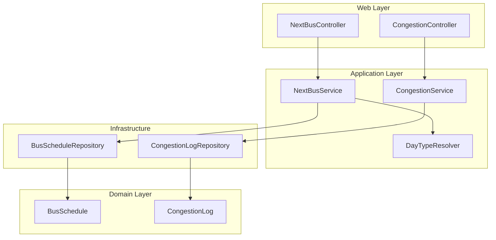

# BusApp バックエンド（設計）

## 役割

時刻表データを保持し、**次の発車時刻**を返す API と、**混雑記録**の保存・参照 API を提供する。永続化は **H2（インメモリ）** を想定し、起動時にスキーマ生成と初期データ投入を行う。

## 技術スタック

| 項目 | 内容 |
|------|------|
| フレームワーク | Spring Boot 3.x |
| Web | Spring Web（REST）、Spring Validation |
| 永続化 | Spring Data JPA、Hibernate |
| DB | H2（ランタイム依存） |
| ビルド | Maven（`mvnw.cmd` で Wrapper 実行可能） |

## レイヤ構成



| レイヤ | パッケージ例 | 責務 |
|--------|----------------|------|
| Web | `com.busapp.web` | HTTP の入出力、ステータスコード（404 等） |
| 応用 | `com.busapp.service` | ユースケース（次の便の検索、混雑の記録） |
| ドメイン | `com.busapp.entity` | エンティティ・列挙型 |
| 永続化 | `com.busapp.repository` | JPA リポジトリ |
| 設定 | `com.busapp.config` | `Clock` Bean、CORS、WebMvc |

## ドメインモデル（時刻表）

### `BusSchedule`

路線・停車地・**発車時刻（時刻のみ）**・**曜日区分（DayType）** を保持する。

- `DayType`: `ALL`（全日）、`WEEKDAY`、`SATURDAY`、`SUNDAY`
- 検索時は「その日のカレンダー」に応じて **複数の DayType が有効**（例: 平日は `ALL` + `WEEKDAY`）となり、`DayTypeResolver` が一覧を組み立てる。

### 次の便の選定ロジック

1. `Clock` から **現在の日付・時刻**を取得（テストでは固定時刻を渡すオーバーロードを利用）。
2. `BusScheduleRepository.findNextDepartures(routeId, stopId, after, dayTypes)` で  
   `departureTime > after` かつ `dayType IN dayTypes` を **発車時刻昇順**で取得。
3. 先頭 1 件を返す。0 件なら `Optional.empty()` → Controller で **404**。

発車時刻の JSON は **`HH:mm:ss` 固定**（`LocalTime.toString()` の省略に依存しない）。

## ドメインモデル（混雑）

### `CongestionLog`

`routeId`、`stopId`、`CongestionLevel`（`EMPTY` / `NORMAL` / `CROWDED`）、`recordedAt`（`Instant`）を保持する。

### `CongestionService`

- `POST`: リクエストボディを検証し、現在時刻（`Clock`）で `recordedAt` を付与して保存。
- `GET /recent`: 直近を降順で取得し、件数上限でスライス。

## REST API

| メソッド | パス | 説明 |
|----------|------|------|
| GET | `/api/bus/next?routeId=&stopId=` | 次の発車。該当なしは **404** |
| POST | `/api/congestion` | `{ routeId, stopId, level }`、**201** |
| GET | `/api/congestion/recent?limit=` | 直近ログ（デフォルト件数あり、上限あり） |

## データベース・初期データ

- **設定**: `src/main/resources/application.yml`  
  - `spring.jpa.hibernate.ddl-auto=create-drop`  
  - `spring.jpa.defer-datasource-initialization=true`  
  - `spring.sql.init.mode=always`
- **初期データ**: `src/main/resources/data.sql`（サンプル路線 `R1` / 停車 `STOP_MAIN`）

## 横断関心事

| 項目 | 実装 |
|------|------|
| CORS | `WebConfig` で `/api/**` に `allowedOriginPatterns("*")` |
| 時刻 | `Clock` Bean（`ClockConfig`）をサービスに注入し、テスト時の差し替えを容易にする |
| サーバ | `server.address=0.0.0.0`、`server.port=8080`（LAN 実機からの到達用） |

## ビルド・テスト

```bash
mvnw.cmd test
mvnw.cmd spring-boot:run
```

H2 コンソールは `application.yml` の設定に従い（例: `/h2-console`）、開発時のデータ確認に利用できる。

## 拡張の指針

- **本番 DB**: PostgreSQL 等へ切り替え、`ddl-auto` と `data.sql` の運用を見直す。
- **路線マスタ**: 停車地・路線を正規化する場合は `Route` / `Stop` エンティティの導入を検討。
- **祝日**: 平日ダイヤの判定に `WEEKDAY` だけでなく祝日カレンダーを組み込む場合は `DayTypeResolver` を拡張する。
